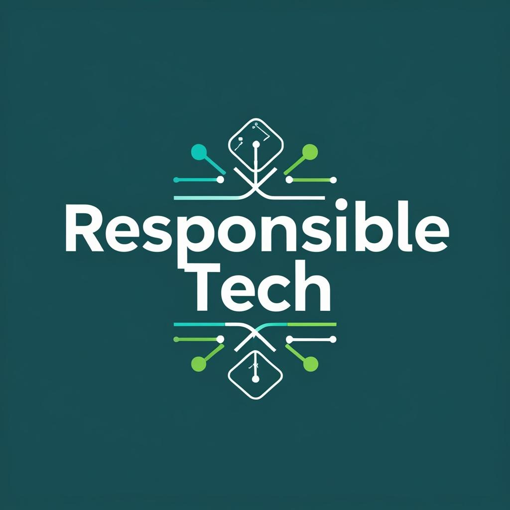

# Responsible Technology

  

A curated reference of organizations, initiatives, open-source packages, and thought leaders dedicated to responsible technology and ethical AI. This repository aims to support researchers, developers, and anyone interested in being responsible when using technology and AI, and in highlighting the good of using tech (instead of focusing solely on commercial benefits) by providing resources on:

- Non-commercial organizations and initiatives in tech-for-good
- Open-source packages and tools for responsible AI
- Influential philosophers and thinkers discussing the societal impact of AI

Contributions are welcome to help expand and update this

## Table of Contents

- [Responsible Technology](#responsible-technology)
  - [Initiatives](#initiatives)
  - [Interviews](#interviews)
  - [Research Entities](#research-entities)
  - [Companies](#companies)
- [Contributing](#contributing)

## Initiatives
| Name                  | Description                                                                                                                                     | Reference                                                                 |
|-----------------------|-------------------------------------------------------------------------------------------------------------------------------------------------|---------------------------------------------------------------------------|
| Tech For Palestine    | Tech for Palestine (“T4P”) is a coalition of thousands of founders, engineers, product marketers, investors and other professionals who are working in support of Palestinian liberation. | [Link](https://techforpalestine.org/) |
| LF AI & Data Foundation | The LF AI & Data Foundation supports open source projects within artificial intelligence and the data space.                                    | [Link](https://lfaidata.foundation/projects/) |
| All Tech Is Human | All Tech Is Human brings together people, organizations, and ideas to grow and strengthen the Responsible Tech ecosystem. | [Link](https://alltechishuman.org/) |
| DATA for GOOD Foundation | DATA for GOOD has developed a neutral platform infrastructure that offers the possibility to connect citizens, companies, and public organizations in a digital ecosystem where data can be shared under the control of the individual citizen enabling new digital services for citizens and value-creating new insights. | [Link](https://arc.net/l/quote/qwjmepus) |
| Digital Impact Alliance | A global alliance, partnering with many of the world’s most influential investors and changemakers in digital development to realize a world where data and digital technology serve people, society, and the planet. | [Link](https://dial.global/)
## Interviews
| Name                  | Description                                                                                                                                     | Reference                                                                 |
|-----------------------|-------------------------------------------------------------------------------------------------------------------------------------------------|---------------------------------------------------------------------------|
Geoffrey Hinton | Godfather of AI: I Tried to Warn Them, But We’ve Already Lost Control! Geoffrey Hinton | [Link](https://www.youtube.com/watch?v=giT0ytynSqg)

## Research Entities 
| Name                  | Description                                                                                                                                     | Reference                                                                 |
|-----------------------|-------------------------------------------------------------------------------------------------------------------------------------------------|---------------------------------------------------------------------------|
| Digital Anthropology Department, UCL University | The Centre for Digital Anthropology is a leading research hub for the understanding of digital technologies in the rich context of human society and culture.  | [Link](https://www.ucl.ac.uk/anthropology/research/centre-digital-anthropology) |
| Social Science Research Council | Mobilizing social science for the public good. | [Link](https://www.ssrc.org/)|

## Companies 
Those are the companies working in tech with good impact as a priority.

| Name                  | Description                                                                                                                                     | Reference                                                                 |
|-----------------------|-------------------------------------------------------------------------------------------------------------------------------------------------|---------------------------------------------------------------------------|
| Wikimedia Foundation | The nonprofit Wikimedia Foundation provides the essential infrastructure for free knowledge. We host Wikipedia, the free online encyclopedia, created, edited, and verified by volunteers around the world, as well as many other vital community projects. All of which is made possible thanks to donations from individuals like you. We welcome anyone who shares our vision to join us in collecting and sharing knowledge that fully represents human diversity. | [Link](https://wikimediafoundation.org/) |
| PolicyEngine | PolicyEngine is a nonprofit that provides free, open source software to compute the impact of public policy. We operate in the US and UK. | [Link](https://policyengine.org) |
| UBI | Analyzing universal basic income policies with open-source research | [Link](https://arc.net/l/quote/bzwtfpqs) |

# Contributing

We welcome contributions! Please see our [Contribution Guidelines](CONTRIBUTING.md) for details on how to get involved.
